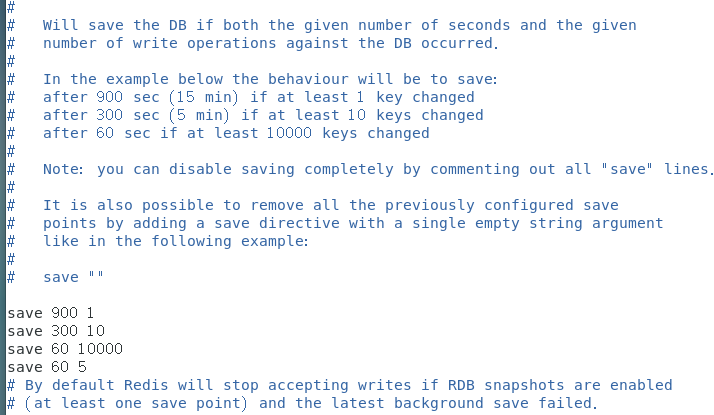

##三、Redis的持久化之RDB

#### 1、RDB(Redis DataBase)

​		他是redis**默认的**持久化方式，在**指定的时间间隔内**将内存中的数据集快照（Snapshot）写入磁盘的二进制文件，所产生的也就是dump.rdb文件，它恢复时是将快照文件直接读到内存里。

#### 2、fock是什么

​		fork的作用是复制一个与当前进程一样的进程。新进程的所有数据（变量、环境变量、程序计数器等）
数值都和原进程一致，但是是一个全新的进程，并作为原进程的子进程。采用了cow技术（Copy On Write，写时复制）

#### 3、RDB原理

​		创建（**fork**）一个子进程来进行持久化，父进程继续处理请求，子进程将数据写入临时文件文件，待持久化过程都结束了，再用这个临时文件替换上次持久化好的文件。

#### 4、RDB的优势

- rdb非常适合灾难恢复
- 对数据完整性和一致性要求不高
- 主进程是不进行任何IO操作的，这就确保了极高的性能
- rdb修复时会比aof更快的重启

#### 5、RDB的劣势

- rdb的缺点是最后一次持久化后的数据可能丢失。
- fock的时候会有两倍的消耗产生。

#### 6、RDB什么时候会触发

触发方式有两种

**一、自动：**

在配置文件中配置触发策略：  save <seconds> <changes>  

Redis默认配置文件中提供了三个条件：  

- save 900 1  ：900秒（15分钟）内有1个更改

- save 300 10  ：300秒（5分钟）内有10个更改

- save 60 10000  ：60秒内有10000个更改。

当在指定时间内有达到了更改次数就会在时间结束后触发rdb，当然这些触发条件也是可以自定义的

这里我又自定义了一条：

```shell
#在一分钟内五次更改就会触发rdb 
save 60 5
```



**二、手动执行命令进行快照保存**

- save ：save时只管保存，其它不管，全部阻塞
- bgsave：Redis会在后台异步进行快照操作，快照同时还可以响应客户端请求。可以通过lastsave命令获取最后一次成功执行快照的时间
- flushall：也会产生dump.rdb文件，但里面是空的，毫无意义，这命令开发肯定永远用不到！

#### 7、如何禁用rdb的自动策略

- 配置：设置 save ""
- 命令：config set save ""
- 这里只是禁用自动策略，但还是可以手动进行rdb备份

####8、RDB恢复数据

- 如果需要恢复数据，只需将**备份文件** (dump.rdb) 移动到 redis **安装目录**并启动服务即可

- 备份文件名称：可以在配置文件中配置**dbfilename**  。

- 安装目录：使用命令**config get dir**获取

#### 9、RDB的dump.rdb文件修复

​		在rdb恢复过程中难免会出点意外，这时候rdb会恢复失败，我们将对dump.rdb文件进行修复，修复完成后继续使用文件进行数据恢复，这里我们使用**redis-check-rdb**进行修复

#### 10、关于RDB的配置文件

- **save <seconds> <changes>**

  指定在多长时间内，有多少次更新操作，就将数据同步到数据文件，可以多个条件配合

  Redis默认配置文件中提供了三个条件：
  save 900 1
  save 300 10
  save 60 10000
  分别表示900秒（15分钟）内有1个更改，300秒（5分钟）内有10个更改以及60秒内有10000个更改。

- **stop-writes-on-bgsave-error yes**

  当bgsave出现错误时，Redis是否停止执行写命令；设置为yes，则当硬盘出现问题时，可以及时发现，避免数据的大量丢失；设置为no，则Redis无视bgsave的错误继续执行写命令，当对Redis服务器的系统(尤其是硬盘)使用了监控时，该选项考虑设置为no

- **rdbcompression yes**

  指定存储至本地数据库时是否压缩数据，默认为yes，Redis采用LZF压缩，如果为了节省CPU时间，可以关闭该选项，但会导致数据库文件变的巨大

- **rdbchecksum yes**

  是否开启RDB文件的校验，在写入文件和读取文件时都起作用；关闭checksum在写入文件和启动文件时大约能带来10%的性能提升，但是数据损坏时无法发现

- **dbfilename dump.rdb**

  指定本地数据库文件名，默认值为dump.rdb

- **dir ./**

  指定本地数据库存放目录
  

