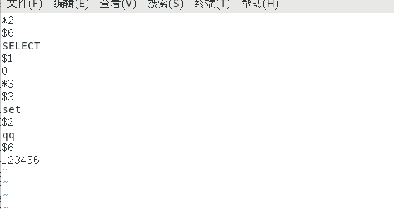
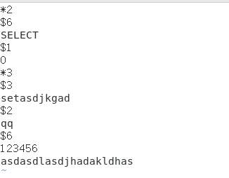
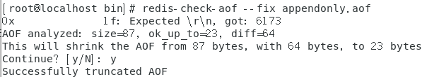

# redis第四讲【redis的持久化之AOF】

####1、AOF(append only file)

​		以日志的形式来记录每个写操作，将Redis执行过的所有写指令记录下来(读操作不记录)，只许追加文件但不可以改写文件，redis启动之初会读取该文件重新构建数据，换言之，redis重启的话就根据日志文件的内容将写指令从前到后执行一次以完成数据的恢复工作

#### 2、AOF优势

- 使用不同的fsync策略（同步内存中所有已修改的文件数据到储存设备），默认的每秒fsync策略的写入性能很好而且只会丢失最后一秒的数据
- 如果aof文件损坏可以使用redis-check-aof工具轻松修复
- redis太大时可以在后台自动重写aof
- aof的日志文件容易理解和解析
- 同时开启rdb和aof恢复的时候会先执行aof

#### 3、AOF劣势

- aof的文件一般相对较大
- 恢复数据的时候要比rdb慢

#### 4、AOF的使用

​		aof默认是关闭的所以我们要在配置文件中打开

```shell
#将原来的no 改成yes
appendonly yes 
```

#### 5、如何修复被损坏的aof文件

redis-check-aof --fix进行修复，他会将我们一些错误的语句进行删除，只留下正确的可以插入的信息

```shell
127.0.0.1:6379> set qq 123456
OK
```

aof文件显示如下，看出来aof的文件容易理解，当然我们也可以进行修改



我在文件中直接添加了一些错误的数据和对set后面乱改了一下，看看他是怎么做处理的



在修复之前要对aof文件进行一个拷贝，然后我们对这个aof文件进行修复，我们看到返回successfully表示成功



再次打开aof文件进行观看


发现他将不认识的数据给删除掉了

我们还可以使用命令**diff -u 文件1 文件2** 对两个aof文件进行对比

修复完数据的时候需要重新启动服务器，让修复后的aof数据生效，不然是不会再继续往aof追加数据的

#### 6、AOF的重写机制

**1、重写机制是什么**

​		AOF采用文件追加方式，文件会越来越大，会导致redis服务器和计算机的存储压力，还会增加aof恢复数据的时间，于是新增了重写机制，当AOF文件的大小超过所设定的阈值时，Redis就会启动AOF文件的内容压缩。

**2、重写机制的原理**

​		AOF文件持续增长而过大时，会fork出一条新进程来将文件重写(也是先写临时文件最后再rename)，
遍历新进程的内存中数据，每条记录有一条的Set语句。重写aof文件的操作，并没有读取旧的aof文件，
而是将整个内存中的数据库内容用命令的方式重写了一个新的aof文件，这点和快照有点类似.

**3、自动触发的阙值**

```shell
#触发的百分比，设置为0表示不重写
auto-aof-rewrite-percentage 100 

#触发重写的最小体积
auto-aof-rewrite-min-size 64mb  
```

当AOF文件的体积大于64MB，并且AOF文件的体积比上一次重写之后的体积大了至少一倍（100%）的时候才会发生重写

**4、手动触发命令**

```shell
BGREWRITEAOF
```

**5、建议**

频繁的重写会大致大量的IO产生，所以我们应该避免频繁的重写，可以将最小触发体积适当的加大。

#### 7、关于aof的配置文件

- **appendonly no**

  是否开启aof 默认不开启，yes为开启

- **appendfilename** 

  aof文件的名称 默认为appendonly.aof

- **appendfsync everysec**

  - no :表示Redis不会主动调用fsync去将AOF日志内容同步到磁盘，操作系统自动调度刷磁盘，性能最快
  - always :表示每次更新操作后手动调用fsync将数据写到磁盘，redis会相对较慢，但数据最安全。
  - everysec :表示每秒同步一次（默认值），这是性能和安全的折衷

- **no-appendfsync-on-rewrite no**

  是否在进行重写aof的时候阻止fsync的调用，默认no是不开启，保证数据完整性的最安全方法。

- **auto-aof-rewrite-percentage 100** 
  **auto-aof-rewrite-min-size 64mb**

  配置aof自动重写的参数，分别是触发的百分比和最小文件大小

- **aof-load-truncated yes**

  在使用aof恢复数据的时候，如果最后一条有问题，是否继续执行，yes会继续执行并写一个log，no会报错，并在修复完成aof文件后才能继续加载

- **aof-use-rdb-preamble yes**

  开启aof和rdb的混合使用

### AOF和RDB用哪个

- 恢复数据时间（rdb > aof）

- 数据完整性（rdb < aof）

- 数据文件的大小（rdb > aof）

  ​	如果可以忍受最后一次数据的损失（数据的不完整）可以简单的使用rdb，但是不建议只使用aof，因为在aof文件发生错误的时候还可以使用rdb进行恢复，如果两者同时开启，会先执行aof恢复数据，这是我们redis服务器发生问题的时候数据的一些解决方法，可当计算机发生问题时，我们的数据又该怎么办呢？

**下节：redis的主从复制和哨兵模式**