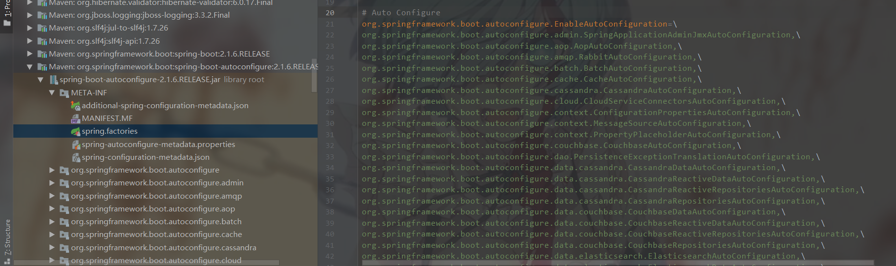

前几天我们学会了如何创建springboot项目今天我们说一下他是怎么运行的为什么不需要我们再去编写繁重的配置文件的

#### @SpringBootApplication

首先我们看一下这个注解，他是用来标注在主程序的，表明他是一个springboot项目

```java
@Target({ElementType.TYPE})
@Retention(RetentionPolicy.RUNTIME)
@Documented
@Inherited
@SpringBootConfiguration
@EnableAutoConfiguration
@ComponentScan(
    excludeFilters = {
      @Filter(type = FilterType.CUSTOM,classes = {TypeExcludeFilter.class}), 	
      @Filter( type = FilterType.CUSTOM,classes = {AutoConfigurationExcludeFilter.class})
    }
)
public @interface SpringBootApplication {
```

点进@SpringBootApplication注解后我们重点关注后三个注解

##### @ComponentScan（包扫描）

- component是组件，scan是扫描，所以这个注解的含义就是用来扫描组件的，


- componentScan就是扫描所标注的类所在包下的所有需要注入的组件，将其注入，这里他是在@SpringBootApplication 中体现的，所以这个注解会自动注入所有在主程序所在包下的组件
- 以前在ssm项目中我们需要去配置我们的包扫描

```java
<context:component-scan base-package="com.xxx"></context:component-scan>
```

##### @EnableAutoConfiguration（开启自动装配）

```java
@Target({ElementType.TYPE})
@Retention(RetentionPolicy.RUNTIME)
@Documented
@Inherited
@AutoConfigurationPackage
@Import({AutoConfigurationImportSelector.class})
public @interface EnableAutoConfiguration {
    String ENABLED_OVERRIDE_PROPERTY = "spring.boot.enableautoconfiguration";

    Class<?>[] exclude() default {};

    String[] excludeName() default {};
}

```

这里我们关注两个注解

一、@AutoConfigurationPackage

```java
@Target({ElementType.TYPE})
@Retention(RetentionPolicy.RUNTIME)
@Documented
@Inherited
@Import({Registrar.class})
public @interface AutoConfigurationPackage {
}
```

在这个注解中，主要是获取我们注解所在包下的组件去进行注册

```java
static class Registrar implements ImportBeanDefinitionRegistrar, DeterminableImports {
        Registrar() {
        }

  //metadata是我们注解所在的元信息
        public void registerBeanDefinitions(AnnotationMetadata metadata, BeanDefinitionRegistry registry) {
          //看这里 将我们注解所在包下所有的组件去进行注册
            AutoConfigurationPackages.register(registry, (new AutoConfigurationPackages.PackageImport(metadata)).getPackageName());
        }

        public Set<Object> determineImports(AnnotationMetadata metadata) {
            return Collections.singleton(new AutoConfigurationPackages.PackageImport(metadata));
        }
    }
```

**register**方法:通过AutoConfigurationPackages去对包下的组件进行注册

```java
private static final String BEAN = AutoConfigurationPackages.class.getName();

public static void register(BeanDefinitionRegistry registry, String... packageNames) {
   //先判断整个BEAN有没有被注册
        if (registry.containsBeanDefinition(BEAN)) {
          //获取bean的定义
            BeanDefinition beanDefinition = registry.getBeanDefinition(BEAN);
          //通过bean获取构造函数的参数值
            ConstructorArgumentValues constructorArguments = beanDefinition.getConstructorArgumentValues();
          //添加参数值，
            constructorArguments.addIndexedArgumentValue(0, addBasePackages(constructorArguments, packageNames));
        } else {
          //创建一个新的bean的定义
            GenericBeanDefinition beanDefinition = new GenericBeanDefinition();
          //设置bean的类型为AutoConfigurationPackages类型
            beanDefinition.setBeanClass(AutoConfigurationPackages.BasePackages.class);
            beanDefinition.getConstructorArgumentValues().addIndexedArgumentValue(0, packageNames);
            beanDefinition.setRole(2);
          //进行bean的注册
            registry.registerBeanDefinition(BEAN, beanDefinition);
        }
    }
```

二、@Import({AutoConfigurationImportSelector.class})

装配我们的 自动配置导入选择器

我们点进去这个类，下面有一个方法getAutoConfigurationEntry 获取自动装配的入口、

```java
protected AutoConfigurationImportSelector.AutoConfigurationEntry getAutoConfigurationEntry(AutoConfigurationMetadata autoConfigurationMetadata, AnnotationMetadata annotationMetadata) {
        if (!this.isEnabled(annotationMetadata)) {
            return EMPTY_ENTRY;
        } else {
            AnnotationAttributes attributes = this.getAttributes(annotationMetadata);
            List<String> configurations = this.getCandidateConfigurations(annotationMetadata, attributes);
            configurations = this.removeDuplicates(configurations);
            Set<String> exclusions = this.getExclusions(annotationMetadata, attributes);
            this.checkExcludedClasses(configurations, exclusions);
            configurations.removeAll(exclusions);
            configurations = this.filter(configurations, autoConfigurationMetadata);
            this.fireAutoConfigurationImportEvents(configurations, exclusions);
            return new AutoConfigurationImportSelector.AutoConfigurationEntry(configurations, exclusions);
        }
    }
```

这个方法他主要是获取了configurations的一个集合在这我们点进去getCandidateConfigurations方法

```java
protected List<String> getCandidateConfigurations(AnnotationMetadata metadata, AnnotationAttributes attributes) {
        List<String> configurations = SpringFactoriesLoader.loadFactoryNames(this.getSpringFactoriesLoaderFactoryClass(), this.getBeanClassLoader());
        Assert.notEmpty(configurations, "No auto configuration classes found in META-INF/spring.factories. If you are using a custom packaging, make sure that file is correct.");
        return configurations;
    }
```

我们首先看他这个红色报错信息：在**META-INF/spring.factories**中没有找到自动配置类。根据他的错误信息我们可以得出他是从META-INF/spring.factories获取我们的自动配置信息的

我们也可以在点进这个**loadFactoryNames**这个方法

```java
 public static List<String> loadFactoryNames(Class<?> factoryClass, @Nullable ClassLoader classLoader) {
        String factoryClassName = factoryClass.getName();
   //调用了下面的方法loadSpringFactories
        return (List)loadSpringFactories(classLoader).getOrDefault(factoryClassName, Collections.emptyList());
    }

    private static Map<String, List<String>> loadSpringFactories(@Nullable ClassLoader classLoader) {
        MultiValueMap<String, String> result = (MultiValueMap)cache.get(classLoader);
        if (result != null) {
            return result;
        } else {
            try {
              //根据类加载器去获取配置文件里的信息
                Enumeration<URL> urls = classLoader != null ? classLoader.getResources("META-INF/spring.factories") : ClassLoader.getSystemResources("META-INF/spring.factories");
                LinkedMultiValueMap result = new LinkedMultiValueMap();

                while(urls.hasMoreElements()) {
                    URL url = (URL)urls.nextElement();
                    UrlResource resource = new UrlResource(url);
                  //配置信息经过多次转换最终成为properties形式
                    Properties properties = PropertiesLoaderUtils.loadProperties(resource);
                    Iterator var6 = properties.entrySet().iterator();
				//循环获取所有的配置信息
                    while(var6.hasNext()) {
                        Entry<?, ?> entry = (Entry)var6.next();
                        String factoryClassName = ((String)entry.getKey()).trim();
                        String[] var9 = StringUtils.commaDelimitedListToStringArray((String)entry.getValue());
                        int var10 = var9.length;

                        for(int var11 = 0; var11 < var10; ++var11) {
                            String factoryName = var9[var11];
                            result.add(factoryClassName, factoryName.trim());
                        }
                    }
                }

                cache.put(classLoader, result);
                return result;
            } catch (IOException var13) {
                throw new IllegalArgumentException("Unable to load factories from location [META-INF/spring.factories]", var13);
            }
        }
    }
```

而这个配置文件在哪里呢

在我们项目的External Libraries中找到我们的spring-boot-autoconfigure中



这样就完成我们默认的一些自动装配了

##### @SpringBootConfiguration

```java
@Target({ElementType.TYPE})
@Retention(RetentionPolicy.RUNTIME)
@Documented
@Configuration
public @interface SpringBootConfiguration {
}

```

这个方法就比较简单了，表明了这是一个配置类

>有过挣扎，有过失败，但仍然会爬起来继续战斗

